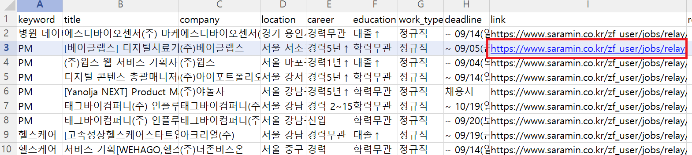
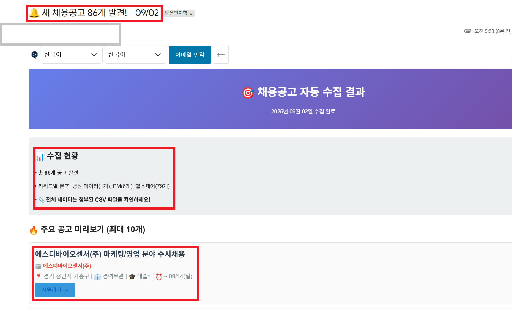
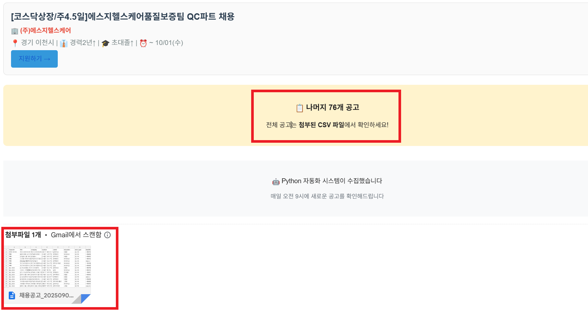

# 🧑‍💻 채용공고 자동 크롤러

사람인(Saramin) 채용공고를 자동으로 수집하고, CSV 저장 및 이메일 알림까지 지원하는 파이썬 크롤러입니다.  
특정 키워드, 연봉, 회사 유형, 고용 형태 등 다양한 조건을 설정하여 원하는 채용공고만 수집할 수 있습니다.  

<br/>
<br/>

## ✨ 주요 기능
- ✅ **사람인 채용공고 자동 크롤링**
- ✅ **검색 필터 적용 가능** (연봉, 회사 유형, 고용 형태, 근무일, 재택 여부 등)
- ✅ **최대 5페이지 크롤링 (중복 제거 포함)**
- ✅ **결과 CSV 저장** (공고 제목, 회사명, 마감일, 지역, 학력, 경력, 링크 등)
- ✅ **이메일 알림 기능** (주요 공고 미리보기 + CSV 첨부)


<br/>
<br/>

## 🛠️ 설치 방법

### 1. 저장소 클론
```bash
git clone https://github.com/yujeong0411/recruit_crawler.git
cd recruit_crawler
```
<br/>

### 2. 가상환경 (선택)
```bash
python -m venv venv
source venv/bin/activate   # Mac/Linux
venv\Scripts\activate      # Windows
```
<br/>

### 3. 패키지 설치
```bash
pip install -r requirements.txt
```
#### 📦 requirements.txt 
```bash
requests
beautifulsoup4
pandas
```


<br/>
<br/>

## 🚀 사용법

### 1. 기본 실행
```bash
python saramin_crawler.py
```
기본적으로 run_advanced_crawler() 가 실행되며, 여러 조건으로 자동 크롤링 진행 후 CSV 저장/이메일 발송을 합니다.
<br/>

### 2. 원하는 조건으로 직접 검색
```bash
from saramin_crawler import SaraminCrawler

crawler = SaraminCrawler()

jobs = crawler.search_jobs(
    keyword="데이터 분석",
    salary_min="3000만원~",
    company_types=["대기업", "중견기업"],
    job_types=["정규직"],
    work_days=["주5일"],
    exclude_keywords=["학교"]
)
```
<br/>

### 3. 이메일 설정
이 프로젝트는 이메일 알림 기능을 위해 3가지 환경변수를 사용합니다:
- `EMAIL_SENDER` : 발신자 이메일 주소 (예: `내메일@gmail.com`)
- `EMAIL_RECEIVER` : 수신자 이메일 주소
- `EMAIL_APP_PASSWORD` : 구글 앱 비밀번호 (일반 계정 비밀번호가 아님!)

> 👉 보안상 코드에 직접 적지 말고, 환경변수 또는 GitHub Actions secrets에 저장하세요.

#### 3-1. Windows CMD
```bash
set EMAIL_SENDER=내메일@gmail.com
set EMAIL_RECEIVER=내메일@gmail.com
set EMAIL_APP_PASSWORD=앱비밀번호
```

#### 3-2. Windows PowerShell
```bash
$env:EMAIL_SENDER="내메일@gmail.com"
$env:EMAIL_RECEIVER="받는사람@gmail.com"
$env:EMAIL_APP_PASSWORD="앱비밀번호"
```

#### 3-3. Mac/Linux
```bash
export EMAIL_SENDER="내메일@gmail.com"
export EMAIL_RECEIVER="받는사람@gmail.com"
export EMAIL_APP_PASSWORD="앱비밀번호"
```

#### 3-4. GitHub Actions Secrets (현재 방식)
GitHub 저장소 → Settings → Secrets and variables → Actions → New repository secret

아래 세 가지를 등록:
- EMAIL_SENDER
- EMAIL_RECEIVER
- EMAIL_APP_PASSWORD

워크플로우에서 자동으로 사용됩니다:
```bash
name: Recruit Crawler

on:
  schedule:
    - cron: "0 0 * * *" # 매일 0시(UTC) 실행 → 한국 시간은 오전 9시
  workflow_dispatch: # 필요 시 수동 실행 버튼도 활성화

jobs:
  run-crawler:
    runs-on: ubuntu-latest

    steps:
      - name: Checkout code
        uses: actions/checkout@v3

      - name: Set up Python
        uses: actions/setup-python@v4
        with:
          python-version: "3.10"

      - name: Install dependencies
        run: |
          pip install requests beautifulsoup4 pandas

      - name: Run crawler
        env:
          EMAIL_SENDER: ${{ secrets.EMAIL_SENDER }}
          EMAIL_RECEIVER: ${{ secrets.EMAIL_RECEIVER }}
          EMAIL_APP_PASSWORD: ${{ secrets.EMAIL_APP_PASSWORD }}
        run: python saramin_crawler.py

```


<br/>
<br/>

## 📊 결과 예시




<br/>
<br/>

## ⚠️ 주의사항

사람인 사이트 구조나 API가 바뀌면 코드가 작동하지 않을 수 있습니다.

단기간에 과도한 요청은 차단될 수 있으므로, 크롤링 시 time.sleep(1) 을 유지하세요.

이메일 기능은 Gmail 기준이며, 타 이메일 서비스는 설정이 다를 수 있습니다.

<br/>
<br/>

## 📌 라이선스
이 프로젝트는 [MIT License](./LICENSE)를 따릅니다.
